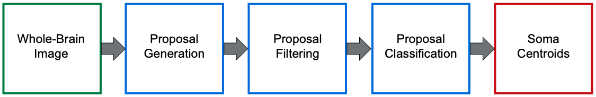
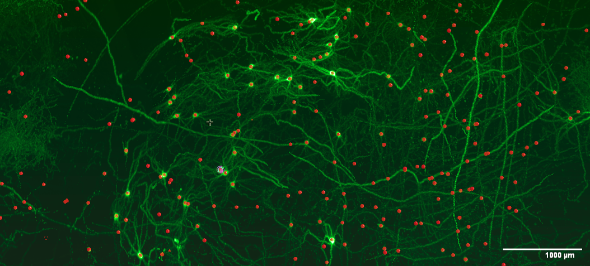
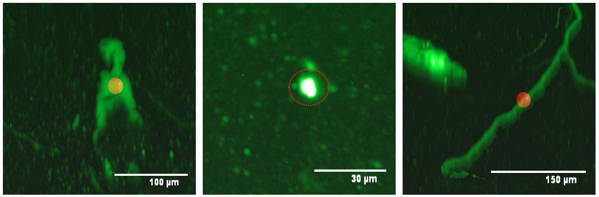
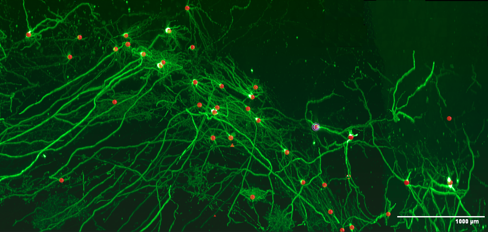

# aind-exaspim-soma-detection

[](LICENSE)

[](https://github.com/semantic-release/semantic-release)


## Overview

This repository implements a pipeline for detecting somas in whole-brain images. It utilizes a multi-step approach to propose, filter, and classify potential soma locations. This method prioritizes high recall in the initial proposal generation, followed by filtering based on prior knowledge of soma characteristics, and finally refines the proposals using a convolutional neural network for classification.

The soma detection pipeline consists of three main steps:

<blockquote>
  <p>a. <strong>Proposal Generation</strong>: Detects blob-like structures to generate initial soma proposals.</p>
  <p>b. <strong>Proposal Filtering</strong>: Filters out trivial false positives using heuristics and prior knowledge of soma characteristics.</p>
  <p>c. <strong>Proposal Classification</strong>: Classify proposals with a convolutional neural network.</p>
</blockquote>
<br>

<p>
  
  <br>
  <b> Figure: </b>Visualization of soma detection pipeline, see Method section for description of each step.
</p>

## Method

### Step 1: Proposal Generation

The goal of this step is to generate initial proposals for soma locations by detecting blob-like structures in the image. The proposal generation algorithm consists of the following steps

<blockquote>
  <p>a. Smooth image with Gaussian filter to reduce false positives.</p>
  <p>b. Laplacian of Gaussian (LoG) with multiple sigmas to enhance regions where the gradient changes rapidly, then apply a max filter.</p>
  <p>c. Generate initial set of proposals by detecting local maximas.</p>
  <p>d. Shift each proposal to the brightest voxel in its neighborhood and reject it if the brightness is below a threshold.</p>
</blockquote>

<p>
  
  <br>
  <b> Figure: </b>Proposals generated across a large region.
</p>

### Step 2: Proposal Filtering

The initial proposal generation step prioritizes high recall, which results in many false positives. This step leverages prior knowledge, such as the Gaussian-like appearance and expected size of somas, to filter out trivial false positives.

<blockquote>
  <p>a. Merges proposals within a given distance threshold.</p>
  <p>b. If the number of proposals exceeds a certain threshold, the top k brightest proposals are kept.</p>
  <p>c. Fit Gaussian to neighborhood centered at proposal and compute fitness score by comparing fitted Gaussian to image values.
        Proposals are discarded if (1) fitness score is below threshold or (2) estimated standard deviation is out of range.</p>
</blockquote>

<p>
  
  <br>
  <b> Figure: </b>Examples of filtered proposals.
</p>

### Step 3: Proposal Classification

Finally, the remaining proposals are classified by a neural network that generates soma likelihoods. Proposals with a likelihood above a given threshold are *accepted* as soma locations.

<p>
  
  <br>
  <b> Figure: </b>Detected somas across a large region.
</p>

## Installation
To use the software, in the root directory, run
```bash
pip install -e .
```

## Usage

Here is an example of calling the main routine to run the full pipeline.

```python

if __name__ == "__main__":
    # Initializations
    brain_id = "unique-identifier-of-dataset"
    img_prefix = "path-to-image"

    # Parameters - Proposal Generation
    multiscale_1 = 4
    patch_shape_1 = (64, 64, 64)
    bright_threshold = 100
    overlap = (28, 28, 28)
    save_proposals_bool = True

    # Parameters - Proposal Classification
    multiscale_2 = 1
    patch_shape_2 = (102, 102, 102)
    accept_threshold = 0.4
    model_path = "path-to-model"
    save_somas_bool = True

    # Main
    main()

```

## Contact Information
For any inquiries, feedback, or contributions, please do not hesitate to contact us. You can reach us via email at anna.grim@alleninstitute.org or connect on [LinkedIn](https://www.linkedin.com/in/anna-m-grim/).

## License
aind-exaspim-soma-detection is licensed under the MIT License.
