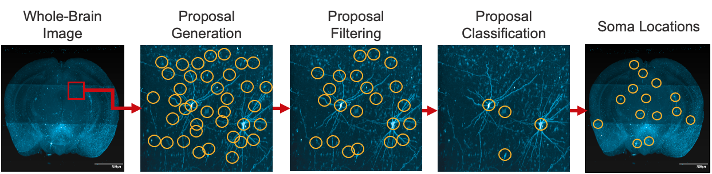
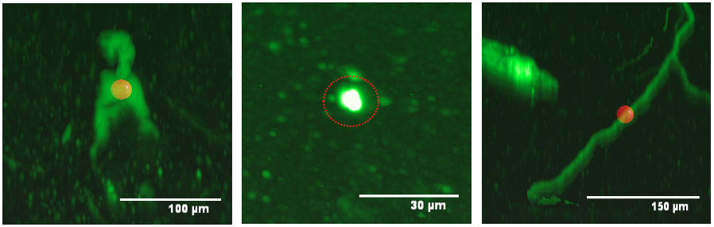

# aind-exaspim-soma-detection

[](LICENSE)

[](https://github.com/semantic-release/semantic-release)


## Overview

To do...

<p>
  
  <br>
  <b> Figure: </b>Visualization of soma detection pipeline. See "Inference" section for description of each step.
</p>
<br>

Here is an example of calling the main routine to run the full inference pipeline.

```python

if __name__ == "__main__":
    # Initializations
    brain_id = "unique-identifier-of-dataset"
    img_prefix = "path-to-image"
    save_proposals_bool = True
    save_somas_bool = True

    # Parameters ~ Proposal Generation
    multiscale_1 = 4
    patch_shape_1 = (64, 64, 64)
    bright_threshold = 100
    overlap = (28, 28, 28)

    # Parameters ~ Proposal Classification
    multiscale_2 = 1
    patch_shape_2 = (102, 102, 102)
    accept_threshold = 0.4
    model_path = "path-to-model"

    # Main
    main()

```


## Inference

### Step 1: Proposal Generation

The objective of this step is to generate initial proposals for potential soma locations by detecting blob-like structures in the image. Our proposal generation algorithm consists the following steps:

<blockquote>
  <p>a. Smooth image with Gaussian filter to reduce false positives.</p>
  <p>b. Laplacian of Gaussian (LoG) with multiple sigmas to enhance regions where the gradient changes rapidly, then apply a non-linear maximum filter.</p>
  <p>c. Generate initial set of proposals by detecting local maximas.</p>
  <p>d. Shift each proposal to the brightest voxel in its neighborhood. If the brightness is below a threshold, reject the proposal.</p>
</blockquote>

<p>
  
  <br>
  <b> Figure: </b>Example of proposals generated across a large region.
</p>

### Step 2: Filter Proposals with Heuristics

The initial proposal generation step is tuned to prioritize high recall which often results in a large number of false positives. The purpose of this step is to use prior knowledge, such as somas having a Gaussian-like appearance and an expected size range, to filter out trivial false positives.

<blockquote>
  <p>a. Compute distances between proposals and merges proposals within a given distance threshold.</p>
  <p>b. If the number of proposals exceeds a certain threshold, the top k brightest proposals are kept.</p>
  <p>c. Fit Gaussian to neighborhood centered at proposal and compute fitness score by comparing fitted Gaussian to image values.
        Proposals are discarded if (1) fitness score is below threshold or (2) estimated standard deviation is out of range.</p>
</blockquote>

<p>
  
  <br>
  <b> Figure: </b>Examples of filtered proposals.
</p>

### Step 3: Classify Proposals with Convolutional Neural Network (CNN)

To do...

## Train Classification Model

To do...

## Installation
To use the software, in the root directory, run
```bash
pip install -e .
```
